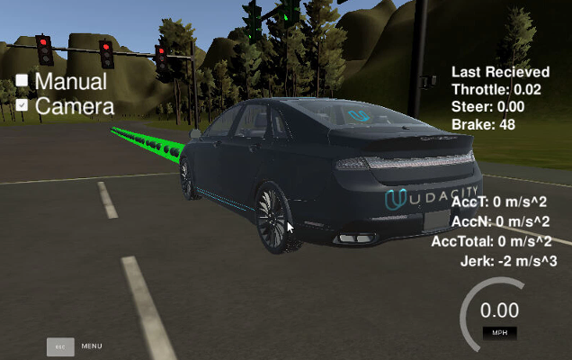
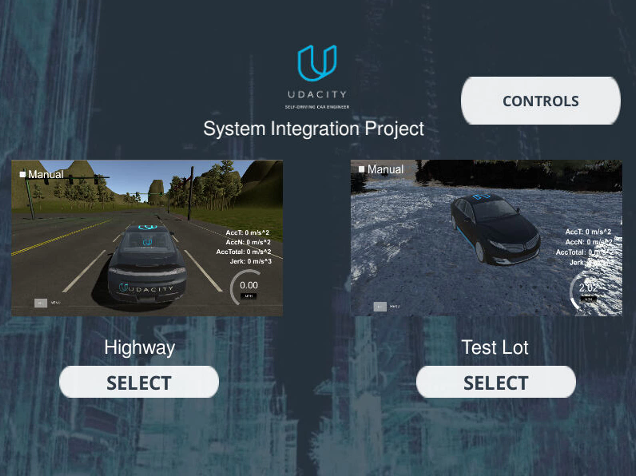
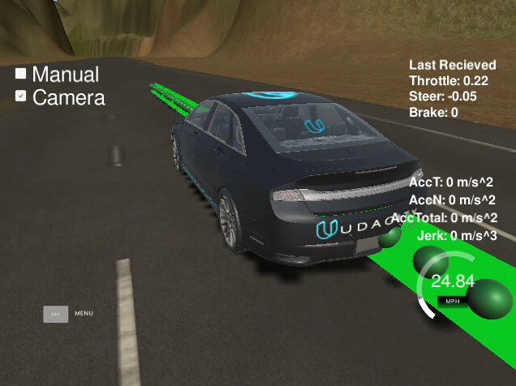
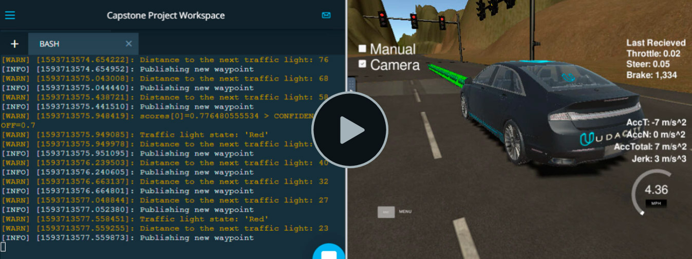

# CarND- Programming a Real Self-Driving Car
Udacity Self-Driving Car Engineer Nanodegree Program <br>
[](http://www.udacity.com/drive)

**Individual submitting**
  
Full Name: 					Ednaldo Gonçalves
Student Hub Display Name: 	Ednaldo G.  
E-mail: 					ednaldo.tic@gmail.com

<p align="center">

</p>

# Overview

In this project we develop a system, using **Robot Operating System (ROS)** nodes, to implement an autonomous vehicle. Our car will follow the designated waypoints along a road, recognizes the traffic light status from camera images, stop on red and restart driving on green. This system is tested on the Udacity simulator and will be tested on the real Udacity self-driving car (Carla) on project delivery.

The goal is to build the software for the entire self-driving car end-to-end both in simulator and on a physical car - the Udacity Carla.

The car should drive around the test track using waypoint navigation and stop at red traffic lights.


My code for this project is publicly available and can be found here: <br>https://github.com/ednaldogoncalves/CarND-Capstone-P9

## Basic Instructions

This is the project repo for the final project of the Udacity Self-Driving Car Nanodegree: Programming a Real Self-Driving Car.

Please use **one** of the two installation options, either native **or** docker installation.

### Native Installation

* Be sure that your workstation is running Ubuntu 16.04 Xenial Xerus or Ubuntu 14.04 Trusty Tahir. [Ubuntu downloads can be found here](https://www.ubuntu.com/download/desktop).
* If using a Virtual Machine to install Ubuntu, use the following configuration as minimum:
  * 2 CPU
  * 2 GB system memory
  * 25 GB of free hard drive space

  The Udacity provided virtual machine has ROS and Dataspeed DBW already installed, so you can skip the next two steps if you are using this.

* Follow these instructions to install ROS
  * [ROS Kinetic](http://wiki.ros.org/kinetic/Installation/Ubuntu) if you have Ubuntu 16.04.
  * [ROS Indigo](http://wiki.ros.org/indigo/Installation/Ubuntu) if you have Ubuntu 14.04.
  
  To follow along with the project, everyone can follow along in the same environment we are providing you with a virtual machine (VM) that is all setup with everything you need. The only problem is that it's a rather large download (4+GB!). So, find yourself a good internet connection and download the [compressed VM disk image](https://s3-us-west-1.amazonaws.com/udacity-selfdrivingcar/Udacity_VM_Base_V1.0.0.zip).
  
* Download the [Udacity Simulator](https://github.com/udacity/CarND-Capstone/releases).

<p align="center">

</p>

### Docker Installation
[Install Docker](https://docs.docker.com/engine/installation/)

Build the docker container
```bash
docker build . -t capstone
```

Run the docker file
```bash
docker run -p 4567:4567 -v $PWD:/capstone -v /tmp/log:/root/.ros/ --rm -it capstone
```

### Port Forwarding
To set up port forwarding, please refer to the "uWebSocketIO Starter Guide" found in the classroom (see Extended Kalman Filter Project lesson).

### Usage

1. Clone the project repository
```bash
git clone https://github.com/udacity/CarND-Capstone.git
```

2. Install python dependencies
```bash
cd CarND-Capstone
pip install -r requirements.txt
```

### Real world testing
1. Download [training bag](https://s3-us-west-1.amazonaws.com/udacity-selfdrivingcar/traffic_light_bag_file.zip) that was recorded on the Udacity self-driving car.
2. Unzip the file
```bash
unzip traffic_light_bag_file.zip
```
3. Play the bag file
```bash
rosbag play -l traffic_light_bag_file/traffic_light_training.bag
```
4. Launch your project in site mode
```bash
cd CarND-Capstone/ros
roslaunch launch/site.launch
```
5. Confirm that traffic light detection works on real life images

### Other library/driver information
Outside of `requirements.txt`, here is information on other driver/library versions used in the simulator and Carla:

Specific to these libraries, the simulator grader and Carla use the following:

|        | Simulator | Carla  |
| :-----------: |:-------------:| :-----:|
| Nvidia driver | 384.130 | 384.130 |
| CUDA | 8.0.61 | 8.0.61 |
| cuDNN | 6.0.21 | 6.0.21 |
| TensorRT | N/A | N/A |
| OpenCV | 3.2.0-dev | 2.4.8 |
| OpenMP | N/A | N/A |

We are working on a fix to line up the OpenCV versions between the two.

# System Architecture

The following is a system architecture diagram (provided by Udacity) showing the **ROS nodes and topics** used in the project: The ROS system can be divided in three main subsystems:

- **Perception:** detects traffic lights and classifies them into red, yellow, green, or unknown
- **Planning:** loads the circuit waypoints and update the waypoint list in front of our car
- **Control:** makes the car to actually move along the waypoints by controlling the car's throttle, steer, and brake using PID controller and low pass filter

The diagram below shows the subsystem division, as well as the ROS nodes and topics.

- nodes: are single process within the ROS graph. The main nodes that we worked on, or completed from the Udacity repository, were:
	- `/tl_detector`: in the perception subsystem.
	- `/waypoint_updater`: in the planning subsystem
	- `/dbw_node`: in the control subsystem
- topics: are named buses over which nodes send and receive messages, by subscribing or publishing to them.

<p align="center">

</p>

### i. Perception (tl_detector.py)

This node subscribes to four topics:
- `/base_waypoints`: provides the complete list of waypoints for the course.
- `/current_pose`: determines the vehicle's location.
- `/image_color`: provides an image stream from the car's camera. 
- `/vehicle/traffic_lights`: provides the (x, y, z) coordinates of all traffic lights.

This node will find the waypoint of the closest traffic light in front of the car. This point will be described by its index counted from the car (e.g.: the number 12 waypoint ahead of the car position). Then, the state of the traffic light will be acquired from the camera image in `/image_color` using the classifier implementation in `tl_classifier.py`. If the traffic light is red, it will publish the waypoint index into the `/traffic_waypoint` topic. This information will be taken by the Planning subsystem to define the desired velocity at the next sequence of waypoints.

<p align="center">

</p>

### ii. Planning (waypoint_updater.py)

This node subscribes to the topics:
- `/base_waypoints`: list of all waypoints for the track
- `/current_pose`: the current position coordinates of our car
- `/traffic_waypoint`: waypoint list of the traffic light in our circuit

It publishes a list of waypoints in front of our car to the topic `/final_waypoints`. The data in waypoints also includes the desired velocity of the car at the given waypoint. If a red traffic light is detected in front of the car, we modify the desired velocity of the `/final_waypoints` up to it in a way that the car slowly stops at the right place.

The number of waypoints is defined by the parameter `LOOKAHEAD_WPS`. If this parameter is too big, there is a big latency updating the waypoints, in a way that the car gets ahead of the list of way points. This confuses the control of the car, which tries to follow the waypoints. I set for a value of 40, to get rid of this latency while still having enough data to properly control the car.

<p align="center">

</p>

### iii. Control (dbw_node.py)

In the control subsystem, Udacity provides an [Autoware](https://www.autoware.org/) software `waypoint_follower.py`. After publishing `/final_waypoints` this software publishes twist commands to the `/twist_cmd` topic, that contain the desired linear and angular velocities.

`dbw_node.py` subscribes to `/twist_cmd`, `/current_velocity`, and `/vehicle/dbw_enabled`. It passes the messages in these nodes to the `Controller` class from `twist_controller.py`. We implemented here the control of the car, using the provided Yaw Controller, PID Controller, and LowPass Filter.

It is important to perfom the control only when `/vehicle/dbw_enabled` is true. When this topic message is false, it means the car is on manual control. In this condition the PID controller would mistakenly accumulate error.

The calculated throttle, brake, and steering are published to the topics:
- `/vehicle/throttle_cmd`
- `/vehicle/brake_cmd`
- `/vehicle/steering_cmd`

<p align="center">

</p>

# Environment Setup
The project requires the use of **Ubuntu Linux** (the operating system of **Carla**) and a **simulator**.

It was time consuming due to Operating System specific problems and performance related problems.

## Running the code
Make sure that the environment has Ubuntu Linux and ROS installed correctly as above, start from project root directory:
```bash
cd CarND-Capstone
cd ros
catkin_make
source devel/setup.sh
roslaunch launch/styx.launch
```
```Bash
(venv) root@ea7a926dfb46:/home/workspace/CarND-Capstone/ros# catkin_make
Base path: /home/workspace/CarND-Capstone/ros
Source space: /home/workspace/CarND-Capstone/ros/src
Build space: /home/workspace/CarND-Capstone/ros/build
Devel space: /home/workspace/CarND-Capstone/ros/devel
Install space: /home/workspace/CarND-Capstone/ros/install
####
#### Running command: "make cmake_check_build_system" in "/home/workspace/CarND-Capstone/ros/build"
####
####
#### Running command: "make -j4 -l4" in "/home/workspace/CarND-Capstone/ros/build"
####
[  0%] Built target _dbw_mkz_msgs_generate_messages_check_deps_Misc1Report
[  0%] Built target _dbw_mkz_msgs_generate_messages_check_deps_TirePressureReport
[  0%] Built target _dbw_mkz_msgs_generate_messages_check_deps_TwistCmd
[  0%] Built target _dbw_mkz_msgs_generate_messages_check_deps_HillStartAssist
[  0%] Built target geometry_msgs_generate_messages_nodejs
[  0%] Built target _dbw_mkz_msgs_generate_messages_check_deps_ParkingBrake
[  0%] Built target _dbw_mkz_msgs_generate_messages_check_deps_TurnSignalCmd
[  0%] Built target _dbw_mkz_msgs_generate_messages_check_deps_BrakeReport
[  0%] Built target std_msgs_generate_messages_nodejs
[  0%] Built target _dbw_mkz_msgs_generate_messages_check_deps_Gear
[  0%] Built target _dbw_mkz_msgs_generate_messages_check_deps_WheelSpeedReport
[  0%] Built target _dbw_mkz_msgs_generate_messages_check_deps_BrakeInfoReport
[  0%] Built target _dbw_mkz_msgs_generate_messages_check_deps_TurnSignal
[  0%] Built target _dbw_mkz_msgs_generate_messages_check_deps_GearReport
[  0%] Built target _dbw_mkz_msgs_generate_messages_check_deps_AmbientLight
[  0%] Built target _dbw_mkz_msgs_generate_messages_check_deps_ThrottleReport
[  0%] Built target _dbw_mkz_msgs_generate_messages_check_deps_GearCmd
[  0%] Built target _dbw_mkz_msgs_generate_messages_check_deps_SteeringCmd
[  0%] Built target _dbw_mkz_msgs_generate_messages_check_deps_ThrottleCmd
[  0%] Built target _dbw_mkz_msgs_generate_messages_check_deps_GearReject
[  0%] Built target _dbw_mkz_msgs_generate_messages_check_deps_SurroundReport
[  0%] Built target _dbw_mkz_msgs_generate_messages_check_deps_SteeringReport
[  0%] Built target _dbw_mkz_msgs_generate_messages_check_deps_FuelLevelReport
[  0%] Built target _dbw_mkz_msgs_generate_messages_check_deps_BrakeCmd
[  0%] Built target _dbw_mkz_msgs_generate_messages_check_deps_ThrottleInfoReport
[  0%] Built target _dbw_mkz_msgs_generate_messages_check_deps_WheelPositionReport
[  0%] Built target std_msgs_generate_messages_lisp
[  0%] Built target geometry_msgs_generate_messages_lisp
[  0%] Built target _dbw_mkz_msgs_generate_messages_check_deps_WatchdogCounter
[  0%] Built target std_msgs_generate_messages_py
[  0%] Built target _dbw_mkz_msgs_generate_messages_check_deps_Wiper
[  0%] Built target geometry_msgs_generate_messages_py
[  0%] Built target std_msgs_generate_messages_cpp
[  0%] Built target std_msgs_generate_messages_eus
[  0%] Built target geometry_msgs_generate_messages_cpp
[  0%] Built target geometry_msgs_generate_messages_eus
[  0%] Built target sensor_msgs_generate_messages_lisp
[  0%] Built target _styx_msgs_generate_messages_check_deps_Waypoint
[  0%] Built target _styx_msgs_generate_messages_check_deps_Lane
[  0%] Built target _styx_msgs_generate_messages_check_deps_TrafficLightArray
[  0%] Built target sensor_msgs_generate_messages_nodejs
[  0%] Built target sensor_msgs_generate_messages_cpp
[  0%] Built target _styx_msgs_generate_messages_check_deps_TrafficLight
[  0%] Built target sensor_msgs_generate_messages_py
[  0%] Built target sensor_msgs_generate_messages_eus
[ 16%] Built target dbw_mkz_msgs_generate_messages_lisp
[ 32%] Built target dbw_mkz_msgs_generate_messages_nodejs
[ 49%] Built target dbw_mkz_msgs_generate_messages_py
[ 59%] Built target styx_msgs_generate_messages_lisp
[ 70%] Built target dbw_mkz_msgs_generate_messages_cpp
[ 84%] Built target dbw_mkz_msgs_generate_messages_eus
[ 88%] Built target styx_msgs_generate_messages_nodejs
[ 91%] Built target styx_msgs_generate_messages_py
[ 93%] Built target styx_msgs_generate_messages_cpp
[ 96%] Built target styx_msgs_generate_messages_eus
[ 96%] Built target dbw_mkz_msgs_generate_messages
[ 96%] Built target styx_msgs_generate_messages
[ 97%] Built target libwaypoint_follower
[100%] Built target pure_pursuit
```
Above are for running with simulator, if running with real site:
Use `roslaunch launch/site.launch`

## Initial code test
Initial test is done by running project code **within the VM** while running the simulator natively in the host machine using port forwarding on port 4567. For more information on how to set up port forwarding, see the end of the classroom concept [**here**](https://s3-us-west-1.amazonaws.com/udacity-selfdrivingcar/files/Port+Forwarding.pdf).

Due to the low performance with the VM and local machine, the initial test can only help ensure the code run without obvious errors, it is a way to **quick check** on code logic and some variables' values.

## Final code test
The Udacity project workspace is installed with Ubuntu linux and ROS already, but GPU time is limited , so only **final test** is done in **the workspace with GPU enabled** after the code can run through initial test.

For example, when the car could run forward in initial test in simulator, but the waypoints were lagging behind the car, and the car would drive out of the track after a while, these would tell us that the code is most likely working but the performance is too bad with the VM, we have to use more powerful system.

When trying to **run the code in workspace**,  following steps are needed:
1. Delete the code files/folders to be updated in workspace
2. Upload the updated code files/folders from local machine where the code is developed
3. Run the command in one terminal of workspace to make sure python files executable:  
`find /home/workspace/CarND-Capstone/ros/src -type f -iname "*.py" -exec chmod +x {} \;`
4. **Enable GPU mode** - ROS only available when GPU enabled!
5. Running the code (as stated above)
6. Go to desktop in workspace and start simulator there

# Implementation
The project was implemented in the order as Udactiy suggested following the project walkthrough:

### Step 1. Waypoint Updater Node (Partial):
Completed a partial waypoint updater which subscribes to `/base_waypoints` and `/current_pose` and publishes to `/final_waypoints`.

The code is in:

- **(path_to_project_repo)/ros/src/waypoint_updater/[waypoint_updater.py](./ros/src/waypoint_updater/waypoint_updater.py).**

The code is able to:
- receive base waypoints and the current position of the car
- figure out the closest waypoint ahead of the car
- generate a lane, i.e. a fixed number of waypoints (LOOKAHEAD_WPS) ahead of the car
- finally publish the lane for car to follow

### Step 2. DBW Node:
 Once the waypoint updater is publishing `/final_waypoints`, the `waypoint_follower` (Autoware software) node will start publishing messages to the `/twist_cmd` topic. Then the DBW node will take the messages.

This part of code is in:

- **(path_to_project_repo)/ros/src/[twist_controller/](./ros/src/twist_controller)**


The goal for this part is to:
 - implement the **drive-by-wire** node (`dbw_node.py`) which subscribes to `/twist_cmd`, `/vehicle/dbw_enabled`, `/current_velocity` and uses various controllers to provide appropriate throttle, brake, and steering commands
 - implement the `Controller` class (`twist_controller.py`) , where a **control** method is implemented to take twist data as input and return **throttle, brake, and steering** values. This class utilized Udacity provided `pid.py` and `lowpass.py` for throttle and acceleration control, `yaw_controller.py` for steering control.

**Important to know**:  
- [line 93](./ros/src/twist_controller/dbw_node.py#L93) in dbw_node.py:
```Bash
 rate_veloity = rospy.Rate(RATE_) # must be 50Hz
 ```
 The DBW system on Carla expects messages at the frequency of 50Hz, if rates are lower, safety feature on the car will return control to the driver.

- [line 87](./ros/src/twist_controller/twist_controller.py#L87) in twist_controller.py
```Bash
  brake = BRAKE_  # N*m , 400 for simulator, 700 for Carla
```
   Because that the Carla has an automatic transmission, to prevent Carla from moving requires about 700 Nm of torque

After this part of development was done, as mentioned earlier, with the code running **in the VM**, the car would always run away from the track, that is due to the **latency**, waypoints are even lagged behind the car:

<p align="center">

</p>

The reduced numbers of LOOKAHEAD_WPS and PUB_RATE are for reducing the impacts of the latency betwen the ROS code and the simulator.

Once the adjustments have been made, from that moment onwards, it is possible for the car to go alone through the waypoints, but without respecting the traffic lights.

<p align="center">

</p>

### **Step 3. Traffic Light Detection**:
Once the car is able to process waypoints, generate steering and throttle commands, and traverse the track, it will need stop for obstacles. Here just focused on Traffic lights.

The code is in:
- **(path_to_project_repo)/ros/src/[tl_detector/](./ros/src/tl_detector)**
```Bash
tl_detector.py
```
```Bash
light_classification/tl_classifier.py
```

The code completed the following:

#### i. Detection: Detect the traffic light

In the `process_traffic_lights` method of `tl_detector.py`:

Use the car's location (from topic `/current_pose`) and the (x, y) coordinates for traffic lights' stoplines(imported from the `traffic_light_config` file) to find the nearest visible traffic light ahead of the car.

After getting the upcoming traffic light position, the light status is determined in 2 ways:
- Utilize the topic `/vehicle/traffic_lights` which contains status of all traffic lights in simulator, so first step just implemented `get_light_state` method in `tl_detector.py` by returning `light.state`.

- Use the camera image data (`/image_color`) to classify the color of the traffic light.  We trained a deep learning classifier to classify the entire image as containing either a red light, yellow light, green light, or no light.

#### ii. Waypoint publishing:
With identified the traffic light status and its position, The traffic light detection node (`tl_detector.py`) will publish the postion(index) of the waypoint for nearest **upcoming red light's stopline** to a single topic `/traffic_waypoint`.

Notes: When utilizing `/vehicle/traffic_lights`  to determine light status, the waypoint publishing is done in `traffic_cb` method.

### Step 4. Waypoint Updater (Full):
Use the waypoint index from `/traffic_waypoint` to change the waypoint target velocities before publishing to `/final_waypoints`.

The code is updated in:

- **(path_to_project_repo)/ros/src/waypoint_updater/[waypoint_updater.py](./ros/src/waypoint_updater/waypoint_updater.py)**.

The goal is to adjust the target velocities for the waypoints leading up to red traffic lights in order to bring the car to a smooth and full stop.
At this point,  the car can stop at red traffic lights and move when they are green, by utilizing `light.state` in simulator.

Now our task left is to implement **traffic light classification using camera images**.

## Traffic Light Classification
The traffic light classification is to detect the traffic light color from the messages of topic **/image_color**, the messages are actually camera images.

In order to obtain an **image classifier**, transfer learning was in consideration, but how to train new models with new dataset for object detection is the key problem.

Alex's work on [Traffic Light Classification](https://github.com/alex-lechner/Traffic-Light-Classification#traffic-light-classification) helped a lot. The basic idea is to leverage **Tensorflow Object Detection API**. The documentation is a little bit confusing and very time consuming for environment setup and configurations for the first time user.

### Environment Setup (Linux)
#### Setup for [Tensorflow Object Detection API](https://github.com/tensorflow/models/tree/master/research/object_detection)

In order to use the API, we followed the installation guide [here](https://github.com/tensorflow/models/blob/master/research/object_detection/g3doc/installation.md), but workarounds are needed when some commands don't work. Most of time they are machine specific problems.


##### i. Installation of Dependencies
Since we already have the lab environment, we only need to install the additional libraries like the following:

```
sudo apt-get install protobuf-compiler python-pil python-lxml python-tk
pip install --user Cython
pip install --user contextlib2
pip install --user jupyter
pip install --user matplotlib
```

##### ii. Download the API

1. Install TensorFlow version 1.4 by executing

    ```
    pip install tensorflow==1.4
    ```

2. Create a new directory somewhere and name it ``tensorflow``

3. Clone TensorFlow's *models* repository from the ``tensorflow`` directory by executing

    ```
    git clone https://github.com/tensorflow/models.git
    ```

4. Navigate to the ``models`` directory in the Command Prompt and execute

    ```
    git checkout f7e99c0
    ```

    This is important because the code from the ``master`` branch won't work with TensorFlow version 1.4. Also, this commit has already fixed broken models from previous commits.

5. Protobuf Compilation

```
# From tensorflow/models/research/
protoc object_detection/protos/*.proto --python_out=.
```

6. Add Libraries to PYTHONPATH

```
# From tensorflow/models/research/
export PYTHONPATH=$PYTHONPATH:`pwd`:`pwd`/slim
```

7. If you run without errors until here, test your installation with

```
python object_detection/builders/model_builder_test.py
```

### Training Models

The following steps were followed according to procedures described in the [Alex data](https://github.com/alex-lechner/Traffic-Light-Classification)

- Dataset of images from the simulator
- Create a TFRecord file. Considering the efficienty and performance, **ssd_inception_v2_coco_2017_11_17** was chosen as pretrained model to train the models for object detection , config files are updated [here](./ros/src/tl_detector/light_classification/config/).
- Configure the `.config` file of the model.
- Test the training process locally (if possible in PC)
- Train with GPUs using Google Cloud Platform (GCP) or AWS spot instance.
- Freezing, export and test the final graph. To the individual image, test results in jupyter notebook [here](./utils/test_object_detection/tl_classification_test.ipynb).

#### i. Simulator Graph Result

Model trained **`10000`** steps
If a light is detected, the score can be up to 99%, the lowest score can also be over 70%

#### ii. Real Site Graph Result

Model trained **`20000`** steps
If a light is detected, most of scores can be over 90% and up to 99%.

### Test in Simulator

#### Without Camera

The car can **run well**, **stop** at each red light perfectly, and **continue** to run till a loop of the track.

<p align="center">
<br>
<a href="./videos/full_video_without_cam.mp4">Download video</a>
</p>

Also performed in the test lot.

<p align="center">
<br>
<a href="./videos/lot_test.mp4">Download video</a>
</p>


#### With Camera

When using image classificaitons, there are some **latency** issues,  the car might not stop perfectly at each red light, it may pass some light even if trying to slow down, or it may run aside from the right track, but **please wait a while**, it could **find its way back** and continue to finish a loop anyway.

The final results:

<p align="center">
Full video of the track lap executed in the project<br>
<a target="_blank" style="text-decoration: none" href="https://www.lgontelecom.com.br/udacity/project9/full_video_high_player.html"></a><br>
<a href="./videos/full_video_high.mp4">Download video</a>
</p>